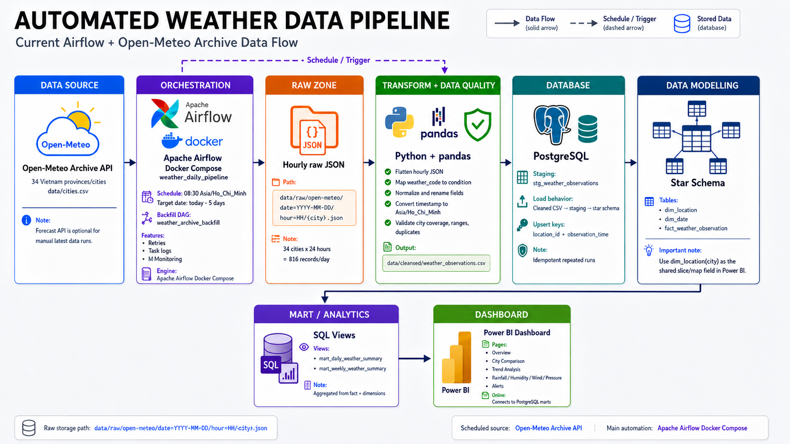
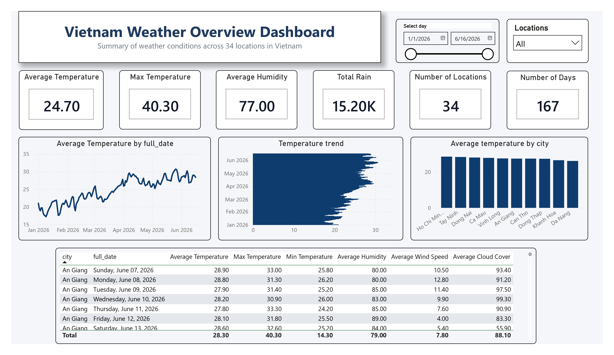
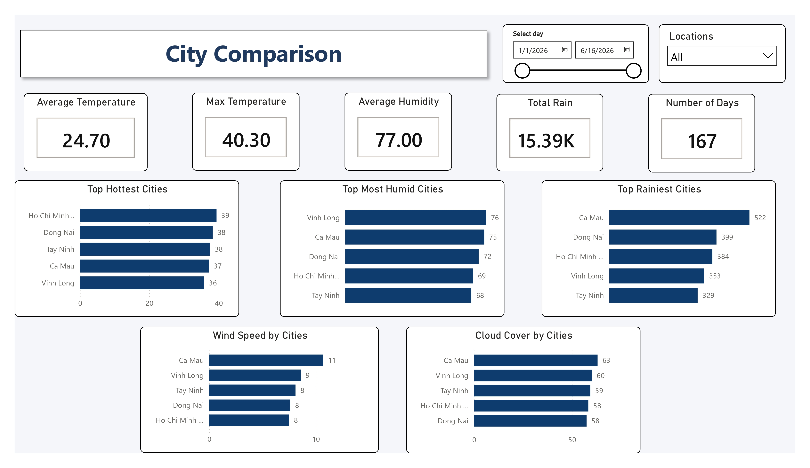
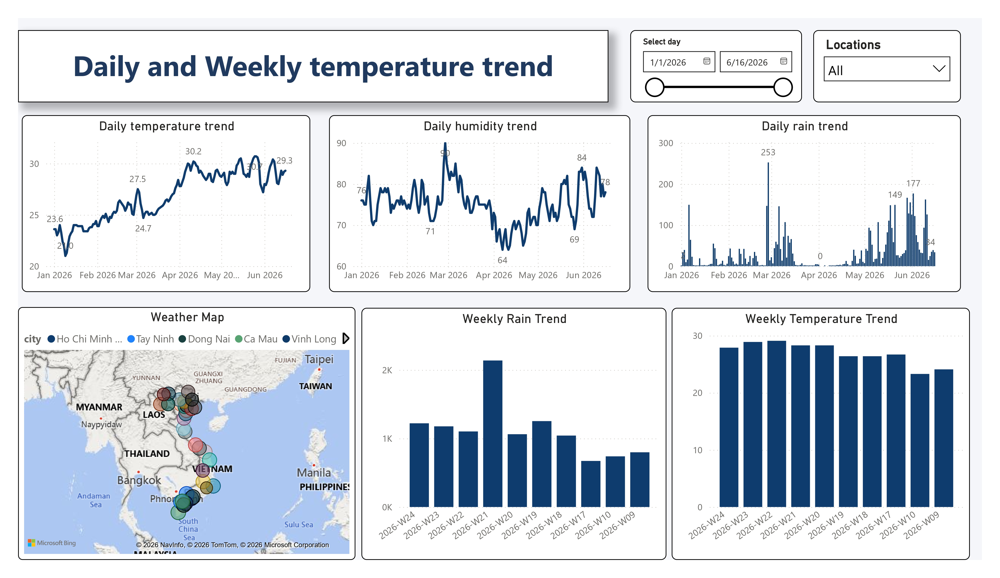

# Automated Weather Data Pipeline

## 1. Project Overview

**Automated Weather Data Pipeline** is a beginner-friendly Data Engineering project that automatically collects verified historical hourly weather data from the **Open-Meteo Archive API**, stores raw JSON responses, transforms and cleans the data using Python, loads the result into PostgreSQL, applies SQL-based data modelling with fact and dimension tables, and builds analytical marts for Power BI dashboards.

This project uses Open-Meteo as the only weather data source. The scheduled daily pipeline uses the Archive endpoint so each automated run loads a completed historical day instead of forecast hours for the current day:

```text
https://archive-api.open-meteo.com/v1/archive
```

Open-Meteo is a good fit for this portfolio project because it returns weather data as JSON, supports hourly variables through latitude and longitude, and does not require an API key for the archive workflow used here.

The pipeline is orchestrated with Apache Airflow, so the daily ETL runs as a scheduled DAG with retries, task-level logs, and a UI for monitoring. The `airflow-scheduler` container is the automation layer that evaluates the DAG schedule and triggers the pipeline inside Docker Compose.

---

## 2. Project Objectives

The main objectives of this project are:

- Automatically collect daily weather data from Open-Meteo.
- Query weather data by city coordinates.
- Store the original Open-Meteo API response as raw JSON files.
- Clean, normalize, and transform weather data using Python.
- Load processed data into PostgreSQL.
- Run data quality checks before loading data into PostgreSQL.
- Design a simple analytical data model using fact and dimension tables.
- Create SQL marts for daily and weekly weather analysis.
- Visualize weather trends using Power BI.
- Orchestrate the daily pipeline with Apache Airflow.

---

## 3. Pipeline Architecture



Current production-style flow:

```text
Open-Meteo Archive API
    -> Airflow DAG schedule
    -> Raw hourly JSON files
    -> Python + pandas transformation
    -> Data quality validation
    -> PostgreSQL staging
    -> dim_location / dim_date / fact_weather_observation
    -> mart_daily_weather_summary / mart_weekly_weather_summary
    -> Power BI dashboard
```

The scheduled DAG is `weather_daily_pipeline`. It runs at `08:30 Asia/Ho_Chi_Minh`,
loads the Archive target date `today - 5 days`, validates the cleaned CSV, and then
loads PostgreSQL marts. The manual DAG `weather_archive_backfill` is used for
historical reloads.

---

## 4. Tech Stack

| Layer | Technology |
|---|---|
| Data Source | Open-Meteo Archive API for scheduled historical loads; Forecast API for optional manual latest-data extraction |
| API Endpoint | `https://archive-api.open-meteo.com/v1/archive` |
| Programming Language | Python |
| API Ingestion | requests |
| Data Processing | pandas |
| Raw Storage | Local JSON files |
| Object Storage | Optional MinIO / S3-compatible bucket sync |
| Database | PostgreSQL |
| Data Modelling | SQL |
| Analytics Layer | SQL views / mart tables |
| Local Database | Docker Compose (postgres:16) |
| Dashboard | Power BI |
| Orchestration | Apache Airflow (`docker-compose.airflow.yml`, `dags/`) |
| Automation | Airflow scheduler container (`airflow-scheduler`) running DAG schedules in Docker Compose |
| Testing / CI | pytest, GitHub Actions |
| Environment Management | python-dotenv, virtual environment (`.venv` / `venv` / `uv`) |

---

## 5. Data Source

The scheduled pipeline collects completed historical weather data from the Open-Meteo Archive API. The repo still keeps a Forecast API extractor for optional manual latest-data runs, but scheduled daily automation uses Archive data to avoid loading future forecast hours.

Open-Meteo requires geographical coordinates, so the pipeline keeps a configured list of cities with latitude and longitude.

The pipeline collects weather for **34 Vietnamese provinces/cities**, configured in `data/cities.csv` and loaded at runtime by `load_cities()` in `src/config.py`. To add or remove a location, edit that CSV — no code change is needed.

First rows of `data/cities.csv`:

| City | Country | Latitude | Longitude |
|---|---|---:|---:|
| Hanoi | Vietnam | 21.0245 | 105.8412 |
| Hai Phong | Vietnam | 20.8449 | 106.6881 |
| Hue | Vietnam | 16.4619 | 107.5955 |
| Da Nang | Vietnam | 16.0678 | 108.2208 |
| Ho Chi Minh City | Vietnam | 10.8230 | 106.6296 |
| Can Tho | Vietnam | 10.0371 | 105.7883 |
| … | … | … | … |

Example scheduled Archive request for Ho Chi Minh City:

```text
https://archive-api.open-meteo.com/v1/archive?latitude=10.823&longitude=106.6296&start_date=2026-06-11&end_date=2026-06-11&hourly=temperature_2m,relative_humidity_2m,apparent_temperature,precipitation,rain,weather_code,cloud_cover,pressure_msl,surface_pressure,wind_speed_10m,wind_direction_10m,wind_gusts_10m&timezone=Asia/Ho_Chi_Minh
```

The pipeline requests these variables from the Open-Meteo `hourly` block and splits each
returned hour into its own `current`-shaped record. Archive responses do not include
`is_day`, so the Archive request also asks for `daily=sunrise,sunset` and derives `is_day`
by comparing each hour against that day's real sunrise/sunset (falling back to a
06:00–18:00 heuristic only if the sun times are missing). Useful Open-Meteo variables include:

| Open-Meteo field | Meaning |
|---|---|
| `current.time` | Observation timestamp |
| `current.temperature_2m` | Temperature at 2 meters |
| `current.relative_humidity_2m` | Relative humidity at 2 meters |
| `current.apparent_temperature` | Apparent temperature |
| `current.precipitation` | Total precipitation |
| `current.rain` | Rain amount |
| `current.weather_code` | Open-Meteo weather condition code |
| `current.cloud_cover` | Cloud cover percentage |
| `current.pressure_msl` | Mean sea level pressure |
| `current.surface_pressure` | Surface pressure |
| `current.wind_speed_10m` | Wind speed at 10 meters |
| `current.wind_direction_10m` | Wind direction at 10 meters |
| `current.wind_gusts_10m` | Wind gusts at 10 meters |
| `current.is_day` | Day or night flag |

---

## 6. Project Folder Structure

```text
automated-weather-data-pipeline/
|
├── data/
│   ├── cities.csv                       # 34 provinces/cities (CSV-driven config)
│   ├── raw/
│   │   └── open-meteo/
│   │       └── date=YYYY-MM-DD/hour=HH/<city>.json
│   └── cleaned/
│       ├── weather_observations.csv     # transformed output for PostgreSQL load
│       └── weather_observations.parquet # columnar analytics copy
|
├── sql/
│   ├── 01_create_staging_table.sql
│   ├── 02_create_dimensions.sql
│   ├── 03_create_fact_table.sql
│   ├── 04_load_star_schema.sql          # runs every batch (staging -> star schema)
│   └── 05_create_marts.sql
|
├── src/
│   ├── config.py
│   ├── extract_weather.py
│   ├── transform_weather.py
│   ├── load_postgres.py
│   └── main.py
|
├── scripts/
│   ├── build_cities_csv.py
│   ├── check_cleaned_data_quality.py    # validation step used by Airflow
│   ├── sync_object_storage.py           # upload existing raw/cleaned files to MinIO/S3
│   └── run_pipeline_task.ps1            # optional manual Windows runner
|
├── dags/
│   ├── weather_daily_pipeline.py        # Airflow daily ETL DAG
│   └── weather_archive_backfill.py      # Airflow manual archive backfill DAG
|
├── asset/                              # pipeline diagram and dashboard screenshots
│   ├── weather-pipeline.png
│   ├── overview.jpg
│   ├── city-comparison.jpg
│   └── daily-weekly-trend.jpg
|
├── docs/
│   └── AIRFLOW.md                      # Airflow runbook
|
├── docker-compose.yml                  # local PostgreSQL + optional MinIO object storage
├── docker-compose.airflow.yml          # local Airflow orchestration stack
├── Dockerfile.airflow                  # Airflow image with project dependencies
├── run_pipeline.bat                    # manual pipeline wrapper
├── .env.example
├── requirements.txt
└── README.md
```

> A Power BI file (`dashboard/weather_dashboard.pbix`) is optional and not committed to the repo.

---

## 7. Pipeline Steps

### 7.1 Extract

The scheduled extraction step calls Open-Meteo Archive using Python and saves the raw JSON response into the local raw data folder.

The scheduled pipeline collects the Open-Meteo **hourly Archive** block for `today - 5 days`
in the local timezone. This delay avoids treating forecast hours as observed history and gives
each city/day a real completed 24-hour temperature range for the daily mart. Every hour is
written as its own `current`-shaped JSON file, partitioned by date and hour so multiple runs
never overwrite each other incorrectly.

Raw files are stored by date, hour, and city.

Example raw storage structure:

```text
data/
└── raw/
    └── open-meteo/
        └── date=2026-06-10/
            ├── hour=00/
            │   ├── ho_chi_minh_city.json
            │   ├── hanoi.json
            │   └── da_nang.json
            ├── hour=01/
            │   └── ...
            └── hour=23/
                └── ...
```

The purpose of storing raw JSON files is to preserve the original API response. This allows the pipeline to reprocess historical data if the transformation logic changes later.

### 7.2 Transform

The transformation step reads raw Open-Meteo JSON files and converts them into structured tabular data.

Main transformation tasks:

- Extract required fields from the `current` block.
- Add city and country from the local city configuration.
- Standardize column names for analytics.
- Convert `current.time` into a proper timestamp.
- Convert `weather_code` into a readable `weather_condition`.
- Handle missing rain and precipitation values.
- Normalize numeric fields.
- Add an `inserted_at` timestamp.
- Prepare the dataset for loading into PostgreSQL.

Output columns may include:

| Column | Description |
|---|---|
| city | City name |
| country | Country name |
| latitude | Location latitude |
| longitude | Location longitude |
| observation_time | Time of weather observation |
| temperature | Temperature value |
| humidity | Humidity percentage |
| apparent_temperature | Apparent temperature |
| pressure_msl | Mean sea level pressure |
| surface_pressure | Surface pressure |
| wind_speed | Wind speed |
| wind_direction | Wind direction |
| wind_gusts | Wind gusts |
| precipitation | Total precipitation |
| rain | Rain amount |
| cloud_cover | Cloud coverage percentage |
| weather_code | Open-Meteo weather code |
| weather_condition | Readable weather condition mapped from `weather_code` |
| is_day | Day or night flag |
| inserted_at | Time when the pipeline inserted the data |

### 7.3 Load

The load step inserts cleaned weather data into a PostgreSQL staging table.

The staging table keeps cleaned but not yet modelled data. It acts as the intermediate layer between raw files and the analytical data model.

Example staging table:

```sql
CREATE TABLE stg_weather_observations (
    city VARCHAR(100),
    country VARCHAR(100),
    latitude NUMERIC(9,6),
    longitude NUMERIC(9,6),
    observation_time TIMESTAMP,
    temperature NUMERIC(5,2),
    humidity NUMERIC(5,2),
    apparent_temperature NUMERIC(5,2),
    pressure_msl NUMERIC(7,2),
    surface_pressure NUMERIC(7,2),
    wind_speed NUMERIC(6,2),
    wind_direction NUMERIC(6,2),
    wind_gusts NUMERIC(6,2),
    precipitation NUMERIC(6,2),
    rain NUMERIC(6,2),
    cloud_cover INT,
    weather_code INT,
    weather_condition VARCHAR(100),
    is_day BOOLEAN,
    inserted_at TIMESTAMP DEFAULT CURRENT_TIMESTAMP
);
```

---

## 8. Data Modelling

This project applies a simple star schema for analytical querying.

The model contains:

- `dim_location`
- `dim_date`
- `fact_weather_observation`

```text
dim_location
      |
      |
fact_weather_observation ---- dim_date
```

### 8.1 Dimension Table: dim_location

The `dim_location` table stores information about each city or location.

```sql
CREATE TABLE dim_location (
    location_id SERIAL PRIMARY KEY,
    city VARCHAR(100),
    country VARCHAR(100),
    latitude NUMERIC(9,6),
    longitude NUMERIC(9,6)
);
```

### 8.2 Dimension Table: dim_date

The `dim_date` table stores date attributes for time-based analysis.

```sql
CREATE TABLE dim_date (
    date_id INT PRIMARY KEY,
    full_date DATE,
    day INT,
    month INT,
    quarter INT,
    year INT,
    day_of_week VARCHAR(20),
    is_weekend BOOLEAN
);
```

### 8.3 Fact Table: fact_weather_observation

The `fact_weather_observation` table stores measurable weather values.

```sql
CREATE TABLE fact_weather_observation (
    observation_id BIGSERIAL PRIMARY KEY,
    location_id INT REFERENCES dim_location(location_id),
    date_id INT REFERENCES dim_date(date_id),
    observation_time TIMESTAMP,
    temperature NUMERIC(5,2),
    humidity NUMERIC(5,2),
    apparent_temperature NUMERIC(5,2),
    pressure_msl NUMERIC(7,2),
    surface_pressure NUMERIC(7,2),
    wind_speed NUMERIC(6,2),
    wind_direction NUMERIC(6,2),
    wind_gusts NUMERIC(6,2),
    precipitation NUMERIC(6,2),
    rain NUMERIC(6,2),
    cloud_cover INT,
    weather_code INT,
    weather_condition VARCHAR(100),
    is_day BOOLEAN,
    inserted_at TIMESTAMP DEFAULT CURRENT_TIMESTAMP
);
```

---

## 9. Analytics Mart

The analytics mart is created for reporting and dashboarding.

Example mart:

```sql
CREATE VIEW mart_daily_weather_summary AS
SELECT
    l.city,
    d.full_date,
    AVG(f.temperature) AS avg_temperature,
    MAX(f.temperature) AS max_temperature,
    MIN(f.temperature) AS min_temperature,
    AVG(f.humidity) AS avg_humidity,
    AVG(f.apparent_temperature) AS avg_apparent_temperature,
    AVG(f.pressure_msl) AS avg_pressure_msl,
    AVG(f.surface_pressure) AS avg_surface_pressure,
    AVG(f.wind_speed) AS avg_wind_speed,
    MAX(f.wind_gusts) AS max_wind_gusts,
    SUM(f.precipitation) AS total_precipitation,
    SUM(f.rain) AS total_rain,
    AVG(f.cloud_cover) AS avg_cloud_cover
FROM fact_weather_observation f
JOIN dim_location l
    ON f.location_id = l.location_id
JOIN dim_date d
    ON f.date_id = d.date_id
GROUP BY
    l.city,
    d.full_date;
```

This mart can be used to answer questions such as:

- What is the average daily temperature by city?
- Which city had the highest temperature?
- How much rain was recorded this week?
- How does humidity change over time?
- Which city has the highest average wind speed?
- How does pressure change by city and date?

---

## 10. Dashboard

Power BI is used as the reporting layer on top of the PostgreSQL star schema and
mart views. The dashboard connects to:

```text
PostgreSQL
  -> dim_location / dim_date / fact_weather_observation
  -> mart_daily_weather_summary / mart_weekly_weather_summary
  -> Power BI
```

The shared city slicer and map field should use `dim_location[city]` so filters
flow consistently to both daily and weekly mart-based visuals.

### 10.1 Overview



The overview page summarizes the current weather dataset with high-level KPI
cards, city-level comparison, and recent weather condition distribution. It is
designed as the first page for quickly checking whether the latest Airflow load
has produced sensible reporting data.

### 10.2 City Comparison



The city comparison page focuses on cross-city analysis. It compares temperature,
rainfall, humidity, wind, pressure, and other weather indicators across the 34
configured Vietnamese provinces/cities.

### 10.3 Daily and Weekly Trends



The trend page uses `mart_daily_weather_summary` and
`mart_weekly_weather_summary` to analyze weather changes over time. It supports
daily trend inspection and weekly aggregation for rainfall, temperature,
humidity, wind, cloud cover, and pressure analysis.

---

## 11. Automation

### Airflow orchestration

The automation layer is Apache Airflow running in Docker Compose. The `airflow-scheduler`
container reads `dags/weather_daily_pipeline.py`, evaluates the DAG schedule
(`30 8 * * *`), and triggers the ETL tasks automatically.

The repo includes:

```text
docker-compose.airflow.yml
Dockerfile.airflow
dags/weather_daily_pipeline.py
dags/weather_archive_backfill.py
docs/AIRFLOW.md
```

Airflow provides DAG-based scheduling, task retries, per-task logs, manual backfill,
and a UI for portfolio/interview demos.

Start the existing weather PostgreSQL database:

```powershell
docker compose up -d
```

Initialize and start Airflow:

```powershell
docker compose -f docker-compose.airflow.yml build
docker compose -f docker-compose.airflow.yml up airflow-init
docker compose -f docker-compose.airflow.yml up -d
```

Unpause the daily DAG so the Airflow scheduler can run it:

```powershell
docker compose -f docker-compose.airflow.yml exec -T airflow-scheduler airflow dags unpause weather_daily_pipeline
```

Open:

```text
http://localhost:8080
```

Login:

```text
Username: airflow
Password: airflow
```

Main DAGs:

| DAG | Schedule | Purpose |
|---|---|---|
| `weather_daily_pipeline` | Daily 08:30 Asia/Ho_Chi_Minh | Archive API catch-up for `today - 5`, then PostgreSQL marts |
| `weather_archive_backfill` | Manual trigger | Archive API backfill, then reload all raw history |

See `docs/AIRFLOW.md` for the full runbook.

Check Airflow status:

```powershell
docker compose -f docker-compose.airflow.yml ps
docker compose -f docker-compose.airflow.yml exec -T airflow-scheduler airflow dags list
docker compose -f docker-compose.airflow.yml exec -T airflow-scheduler airflow dags list-runs weather_daily_pipeline
```

Airflow runs the daily pipeline through these DAG tasks:

```text
init_schema
  -> resolve_archive_target_date
  -> backfill_archive_day
  -> transform_archive_day
  -> validate_cleaned_data
  -> load_postgres_marts
```

### Optional MinIO object storage

The pipeline can also sync generated files to a local MinIO bucket. This is an
S3-compatible portfolio setup. In Airflow, raw JSON is written directly to MinIO,
then the transform step reads raw from MinIO when no local raw partition exists.
Cleaned CSV/Parquet files are still written locally for PostgreSQL loading and
uploaded to MinIO as analytics copies.

Start PostgreSQL and MinIO:

```powershell
docker compose up -d
```

MinIO endpoints:

```text
S3 API:  http://127.0.0.1:9000
Console: http://127.0.0.1:9001
Login:   minioadmin / minioadmin
```

Enable sync in `.env`:

```text
OBJECT_STORAGE_ENABLED=true
RAW_LOCAL_WRITE_ENABLED=false
S3_ENDPOINT_URL=http://127.0.0.1:9000
S3_BUCKET=weather-pipeline
AWS_ACCESS_KEY_ID=minioadmin
AWS_SECRET_ACCESS_KEY=minioadmin
```

When enabled, the pipeline uploads:

```text
raw/open-meteo/date=YYYY-MM-DD/hour=HH/<city>.json
cleaned/weather_observations.csv
cleaned/weather_observations.parquet
```

`RAW_LOCAL_WRITE_ENABLED=false` means raw JSON will not be created under
`data/raw/open-meteo`; it is put directly to the configured MinIO/S3 bucket.

To upload files that already exist locally, run:

```powershell
python scripts/sync_object_storage.py
```

### main.py CLI flags

`src/main.py` orchestrates the pipeline through `argparse`. By default it extracts and transforms;
loading into PostgreSQL only happens with `--load`.

| Flag | Effect |
|---|---|
| (none) | Extract from Open-Meteo Forecast API, then transform the current batch to cleaned CSV |
| `--load` | Also load cleaned data into PostgreSQL and rebuild the star schema; scheduled automation uses Archive first, then `--skip-extract --date <target-date> --load` |
| `--init-db` | Create the schema (staging, dims, fact, marts), then exit |
| `--skip-extract` | Transform existing raw JSON without calling the API |
| `--extract-only` | Only fetch raw JSON, skip transform (cannot combine with `--load`) |
| `--date YYYY-MM-DD` | Transform raw JSON from one date partition |
| `--all-raw` | Reprocess the entire raw history instead of the latest batch |

---

## 12. Data Quality, Backfill, and Tests

Before loading cleaned data into PostgreSQL, the pipeline validates the batch with
`src/data_quality.py`.

Current checks include:

- Required dashboard/staging columns are present.
- All configured 34 cities are present for each observation date.
- `humidity` and `cloud_cover` are between 0 and 100.
- `temperature` is within a realistic range.
- `precipitation`, `rain`, `wind_speed`, and `wind_gusts` are non-negative.
- `(city, observation_time)` rows are not duplicated.

Historical and scheduled daily catch-up are available through the Open-Meteo Archive API:

```bash
python src/backfill_weather.py --start-date 2026-05-10 --end-date 2026-06-08
python src/main.py --skip-extract --all-raw --load
```

The hourly backfill writes one raw file per city-hour. A complete day is expected to
produce `34 cities * 24 hours = 816` raw records, and a complete 30-day backfill is
about `24,480` raw records before any skipped null hours. Re-running the same load
does not duplicate `fact_weather_observation` rows because the star-schema load
upserts on `(location_id, observation_time)`. If an older forecast row already exists
for the same city-hour, a later Archive batch updates it with verified historical values.

Run automated tests:

```bash
pytest
```

The test suite covers:

- CLI guard for invalid `--extract-only --load` usage.
- Raw JSON to cleaned CSV transformation.
- Data quality pass/fail cases for coverage, humidity, and duplicate rows.

GitHub Actions runs the same tests on push and pull request via `.github/workflows/ci.yml`.

You can also generate a local HTML visual report from raw history:

```bash
python scripts/generate_weather_visual_report.py
```

This writes:

```text
reports/weather_snapshot.html
reports/weather_snapshot_latest.html
```

These report files are local artifacts and are ignored by Git.

---

## 13. Environment Variables

Open-Meteo does not require an API key for this workflow, so the `.env` file should focus on the API base URL, timezone, and PostgreSQL credentials.

Example `.env.example`:

```text
OPEN_METEO_BASE_URL=https://api.open-meteo.com/v1/forecast
WEATHER_TIMEZONE=Asia/Ho_Chi_Minh

DB_HOST=127.0.0.1
DB_PORT=5432
DB_NAME=weather_db
DB_USER=postgres
DB_PASSWORD=postgres

OBJECT_STORAGE_ENABLED=false
S3_ENDPOINT_URL=http://127.0.0.1:9000
S3_BUCKET=weather-pipeline
S3_REGION=us-east-1
S3_RAW_PREFIX=raw/open-meteo
S3_CLEANED_PREFIX=cleaned
AWS_ACCESS_KEY_ID=minioadmin
AWS_SECRET_ACCESS_KEY=minioadmin
```

The `.env` file should not be committed to GitHub.

---

## 14. Requirements

Example `requirements.txt`:

```text
requests
python-dotenv
pandas
pyarrow
psycopg2-binary
SQLAlchemy
pytest
boto3
```

Install dependencies:

```bash
pip install -r requirements.txt
```

---

## 15. How to Run

### Step 1: Clone the repository

```bash
git clone https://github.com/your-username/automated-weather-data-pipeline.git
cd automated-weather-data-pipeline
```

### Step 2: Create virtual environment

```bash
python -m venv venv
source venv/bin/activate
```

For Windows:

```bash
venv\Scripts\activate
```

### Step 3: Install dependencies

```bash
pip install -r requirements.txt
```

### Step 4: Configure environment variables

Create a `.env` file based on `.env.example`.

```bash
cp .env.example .env
```

Then update the PostgreSQL credentials if needed.

### Step 5: Configure cities

Cities are defined in `data/cities.csv` (CSV-driven — no code change needed). Each row is
`city,country,latitude,longitude`:

```text
city,country,latitude,longitude
Hanoi,Vietnam,21.0245,105.8412
Hai Phong,Vietnam,20.8449,106.6881
Ho Chi Minh City,Vietnam,10.823,106.6296
...
```

Add or remove rows to change which locations the pipeline collects.

### Step 6: Start PostgreSQL and optional MinIO

The repo ships a `docker-compose.yml` with PostgreSQL 16 and MinIO. Start it with:

```bash
docker compose up -d
```

The `POSTGRES_*` values match `.env` (`DB_NAME` / `DB_USER` / `DB_PASSWORD`).
MinIO is only used by the pipeline when `OBJECT_STORAGE_ENABLED=true`.

### Step 7: Create database tables

Create the schema once (staging, dimensions, fact, marts):

```bash
python src/main.py --init-db
```

This runs `sql/01`, `02`, `03`, and `05`. Note: `sql/04_load_star_schema.sql` is **not** run here —
it loads data from staging into the star schema and runs on every `--load` batch instead.

### Step 8: Run the pipeline manually

Manual latest-data run (Forecast API extract → transform → load into PostgreSQL):

```bash
python src/main.py --load
```

Useful variants:

```bash
python src/main.py                       # extract + transform only (no DB)
python src/main.py --skip-extract --load # re-transform existing raw, then load
python src/main.py --date 2026-06-10     # transform one date partition
python src/main.py --all-raw             # reprocess the full raw history
python src/backfill_weather.py --start-date 2026-05-10 --end-date 2026-06-08
pytest
```

### Step 9: Schedule daily Archive runs

Start Airflow and unpause the daily DAG:

```powershell
docker compose -f docker-compose.airflow.yml build
docker compose -f docker-compose.airflow.yml up airflow-init
docker compose -f docker-compose.airflow.yml up -d
docker compose -f docker-compose.airflow.yml exec -T airflow-scheduler airflow dags unpause weather_daily_pipeline
```

Then verify with:

```powershell
docker compose -f docker-compose.airflow.yml ps
docker compose -f docker-compose.airflow.yml exec -T airflow-scheduler airflow dags list-runs weather_daily_pipeline
```

---

## 16. Expected Output

After the pipeline runs successfully, the system should produce:

- Raw Open-Meteo JSON files stored by date, hour, and city slug.
- Cleaned weather data loaded into PostgreSQL.
- Data quality validation before the staging load.
- Cleaned CSV plus Parquet output for reusable analytical storage.
- Fact and dimension tables for analytical querying.
- SQL mart table or view for dashboard reporting.
- Power BI-ready marts and optional local HTML visual reports.
- Automated daily execution through Airflow DAG scheduling.
- Automated test checks through pytest and GitHub Actions CI.

---

## 17. Future Improvements

Possible improvements for future versions:

- [Done locally] Store raw JSON and cleaned data in MinIO/S3-compatible object storage.
- [Done] Save cleaned data as Parquet files alongside the CSV load artifact.
- Use dbt for data modelling and testing.
- Expand data quality checks with Great Expectations or Pandera if the project grows.
- Deploy PostgreSQL on AWS RDS.
- Deploy Airflow on a small cloud VM or a managed Airflow platform.
- Add forecasting models for temperature or rainfall prediction.
- Track machine learning experiments with MLflow.

---

## 18. Skills Demonstrated

This project demonstrates the following Data Engineering skills:

- Open-Meteo API ingestion
- JSON processing
- ETL pipeline development
- Raw data storage
- Python data transformation
- PostgreSQL database loading
- Data quality validation
- SQL data modelling
- Star schema design
- Fact and dimension table design
- Historical backfill
- Airflow DAG orchestration
- Automated testing and CI
- SQL analytics
- Dashboard design
- Pipeline automation
- Environment variable management
- Portfolio project documentation
