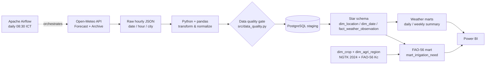
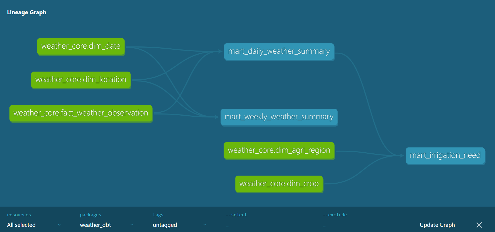
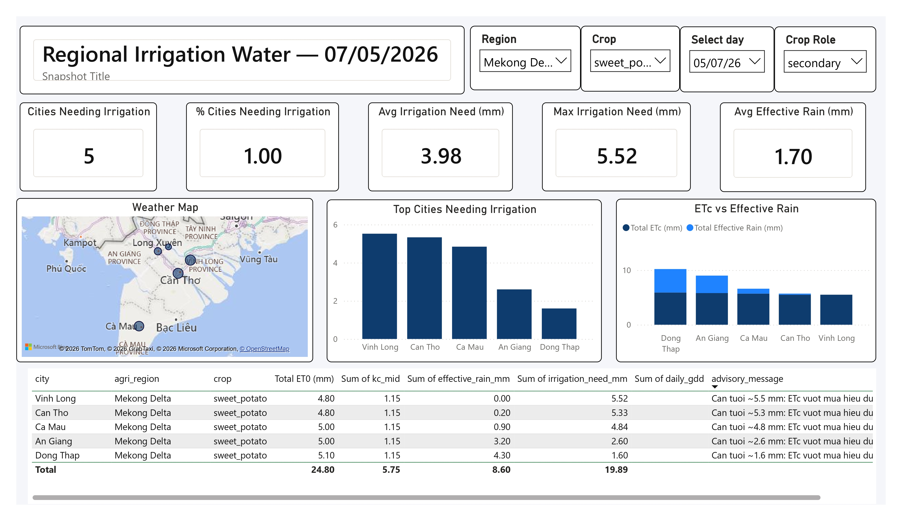
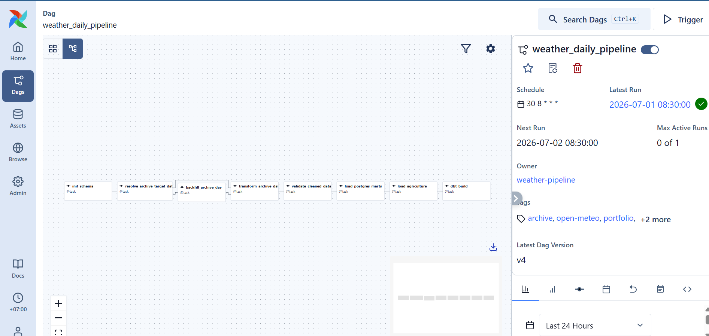
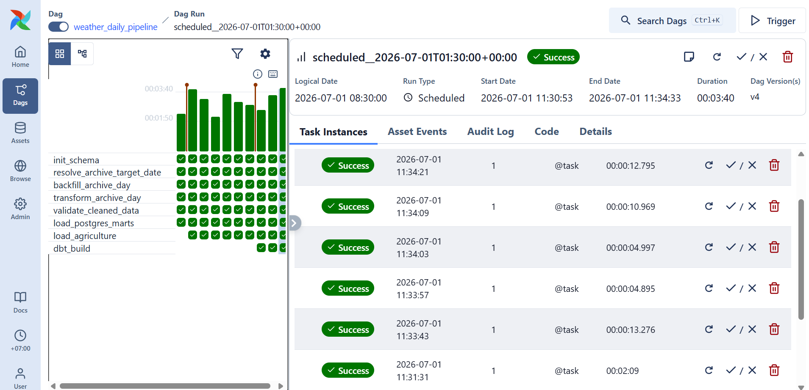
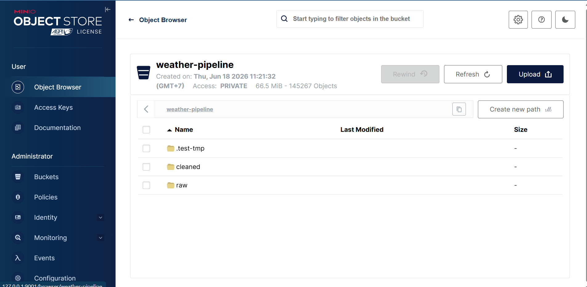
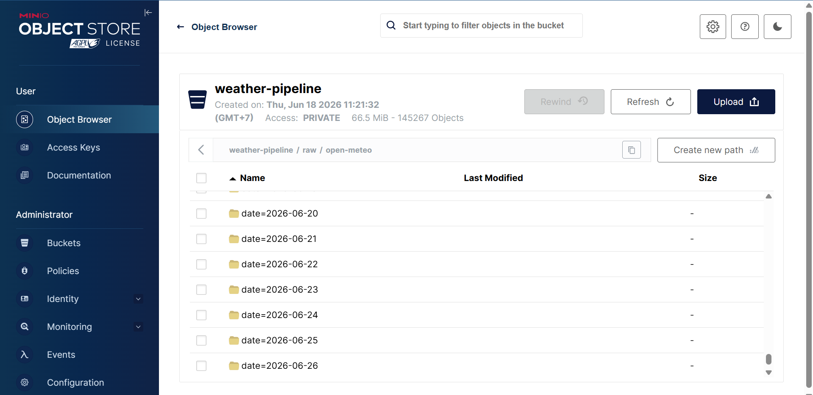
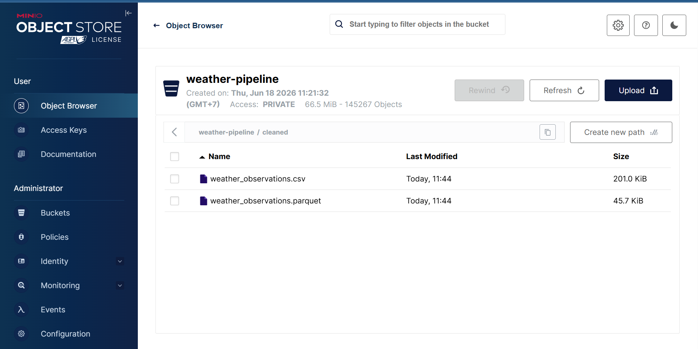

# Automated Weather Data Pipeline

> **What it is** — An end-to-end data pipeline that turns free public weather data for 34 Vietnamese provinces into **region-level irrigation guidance** using the **FAO-56** agronomic model (`ETc = ET0 × Kc − effective rainfall`).
>
> **How it's built** — `extract → transform → load` into a PostgreSQL star schema, guarded by a data-quality gate and idempotent loads, orchestrated daily by Apache Airflow, with optional MinIO/S3 object storage and pytest + GitHub Actions CI.
>
> **What it's honest about** — every agronomic constant is sourced to FAO-56; fields with no published source (e.g. per-province crop area) are left **NULL rather than fabricated**; flooded paddy rice is modelled as *water balance not applicable* instead of a misleading 0 mm.

## 1. Project Overview

**Automated Weather Data Pipeline** is a beginner-friendly Data Engineering project that automatically collects verified historical hourly weather data from the **Open-Meteo Archive API**, stores raw JSON responses, transforms and cleans the data using Python, loads the result into PostgreSQL, applies SQL-based data modelling with fact and dimension tables, and builds analytical marts for Power BI dashboards.

This project uses Open-Meteo as the only weather data source. The scheduled daily pipeline uses the Archive endpoint so each automated run loads a completed historical day instead of forecast hours for the current day:

```text
https://archive-api.open-meteo.com/v1/archive
```

Open-Meteo is a good fit for this portfolio project because it returns weather data as JSON, supports hourly variables through latitude and longitude, and does not require an API key for the archive workflow used here.

The pipeline is orchestrated with Apache Airflow, so the daily ETL runs as a scheduled DAG with retries, task-level logs, and a UI for monitoring. The `airflow-scheduler` container is the automation layer that evaluates the DAG schedule and triggers the pipeline inside Docker Compose.

---

## 2. Project Objectives

Automatically collect hourly weather for 34 Vietnamese provinces, store the raw API response,
clean and transform it in Python, validate it, load a PostgreSQL star schema, model daily/weekly
and FAO-56 irrigation marts in dbt, visualise in Power BI, and orchestrate the whole thing daily
with Apache Airflow.

---

## 3. Pipeline Architecture




The scheduled DAG is `weather_daily_pipeline`. It runs at `08:30 Asia/Ho_Chi_Minh`,
loads the Archive target date `today - 5 days`, validates the cleaned CSV, and then
loads PostgreSQL marts. The manual DAG `weather_archive_backfill` is used for
historical reloads.

---

## ⭐ Highlight: FAO-56 Irrigation Advisory (agriculture layer)

Beyond charting weather, the pipeline answers an operational question:
**"Which region needs irrigation today — how many mm — or has rainfall already covered it?"**

It applies the **FAO-56** crop-water model (Allen et al., 1998, *Irrigation & Drainage Paper 56*)
inside a dbt mart (`weather_dbt/models/marts/mart_irrigation_need.sql`):

- **ETc = ET0 × Kc** — reference evapotranspiration (Open-Meteo `et0_fao_evapotranspiration`,
  summed over 24 h) times a crop coefficient.
- **Irrigation need = max(0, ETc − effective rainfall)**.
- **GDD = max(0, (Tmax + Tmin) / 2 − T_base)** for crops that have a sourced base temperature.

Every coefficient is **sourced, never invented**: `dim_crop` stores `kc_mid` with a `kc_source`
citing FAO-56 Table 12, and `t_base_c` is left NULL for crops where FAO-56 gives no base temperature.

Two **independent** crop axes, with no fabricated area ratios:

| Axis | Meaning | Source |
|---|---|---|
| `crop_role = 'primary'` | the **largest sown-area crop** of each province (1 per province) | NGTK 2024 national statistics, per-province sown-area tables |
| `is_flagship = TRUE` | the **economically signature crop** of a region (coffee — Central Highlands, tea — Thai Nguyen, citrus, rubber) | qualitative; FAO-56 Kc exists, but national stats have **no per-province area** |

> These are orthogonal: a province can be `primary = rice` (most area) **and** `is_flagship = coffee`
> (its signature crop) at the same time. `primary` is strictly "largest sown area" — **not** a claim
> about which crop matters economically.

Honesty by design (these caveats are the point — this is a data-integrity showcase, not a shipped product):

- **Flooded paddy rice → `irrigation_need_mm = NULL`** (`water_balance_applicable = FALSE`):
  ponded fields are not modelled by ET0×Kc, so the mart returns NULL, not a misleading 0 mm.
- **`area_share` is deliberately NULL** where no per-province source exists for the post-2025
  34-province boundaries — un-fabricated, *not* "missing data".
- The output is **region-level decision support, not validated against field water measurements
  or yield.** Effective rainfall is approximated by daily total rain, so on heavy-rain days the
  irrigation need is a lower bound.

`mart_irrigation_need` (grain: `city × full_date × crop`) exposes `crop`, `crop_role`,
`is_flagship`, `total_et0_mm`, `kc_mid`, `etc_mm`, `effective_rain_mm`, `irrigation_need_mm`,
`daily_gdd`, `avg_soil_moisture`, `water_balance_applicable`, and a plain-language
`advisory_message` — ready for a Power BI irrigation page.

---

## 4. Tech Stack

| Layer | Technology |
|---|---|
| Data Source | Open-Meteo Archive API for scheduled historical loads; Forecast API for optional manual latest-data extraction |
| API Endpoint | `https://archive-api.open-meteo.com/v1/archive` |
| Programming Language | Python |
| API Ingestion | requests |
| Data Processing | pandas |
| Raw Storage | Local JSON files |
| Object Storage | Optional MinIO / S3-compatible bucket sync |
| Database | PostgreSQL |
| Data Modelling | Fact + dimensions via SQL DDL; **marts modelled in dbt** (`weather_dbt/`) |
| Analytics Layer | dbt models (`ref()`/`source()`) with declarative tests |
| Local Database | Docker Compose (postgres:16) |
| Dashboard | Power BI |
| Orchestration | Apache Airflow (`docker-compose.airflow.yml`, `dags/`) |
| Automation | Airflow scheduler container (`airflow-scheduler`) running DAG schedules in Docker Compose |
| Testing / CI | pytest, GitHub Actions |
| Environment Management | python-dotenv, virtual environment (`.venv` / `venv` / `uv`) |

---

## 5. Data Source

The scheduled pipeline collects completed historical weather data from the Open-Meteo Archive API. The repo still keeps a Forecast API extractor for optional manual latest-data runs, but scheduled daily automation uses Archive data to avoid loading future forecast hours.

Open-Meteo requires geographical coordinates, so the pipeline keeps a configured list of cities with latitude and longitude.

The pipeline collects weather for **34 Vietnamese provinces/cities**, configured in `data/cities.csv` and loaded at runtime by `load_cities()` in `src/config.py`. To add or remove a location, edit that CSV — no code change is needed.

First rows of `data/cities.csv`:

| City | Country | Latitude | Longitude |
|---|---|---:|---:|
| Hanoi | Vietnam | 21.0245 | 105.8412 |
| Hai Phong | Vietnam | 20.8449 | 106.6881 |
| Hue | Vietnam | 16.4619 | 107.5955 |
| Da Nang | Vietnam | 16.0678 | 108.2208 |
| Ho Chi Minh City | Vietnam | 10.8230 | 106.6296 |
| Can Tho | Vietnam | 10.0371 | 105.7883 |
| … | … | … | … |

Example scheduled Archive request for Ho Chi Minh City:

```text
https://archive-api.open-meteo.com/v1/archive?latitude=10.823&longitude=106.6296&start_date=2026-06-11&end_date=2026-06-11&hourly=temperature_2m,relative_humidity_2m,apparent_temperature,precipitation,rain,weather_code,cloud_cover,pressure_msl,surface_pressure,wind_speed_10m,wind_direction_10m,wind_gusts_10m&timezone=Asia/Ho_Chi_Minh
```

The pipeline requests the standard weather variables (temperature, humidity, precipitation, rain,
weather code, cloud cover, pressure, wind speed/direction/gusts) from the Open-Meteo `hourly` block
and splits each returned hour into its own `current`-shaped record. Archive responses do not include
`is_day`, so the Archive request also asks for `daily=sunrise,sunset` and derives `is_day` by
comparing each hour against that day's real sunrise/sunset (falling back to a 06:00–18:00 heuristic
only if the sun times are missing).

---

## 6. Project Folder Structure

```text
automated-weather-data-pipeline/
|
├── data/
│   ├── cities.csv                       # 34 provinces/cities (CSV-driven config)
│   ├── raw/
│   │   └── open-meteo/
│   │       └── date=YYYY-MM-DD/hour=HH/<city>.json
│   ├── cleaned/
│   │   ├── weather_observations.csv     # transformed output for PostgreSQL load
│   │   └── weather_observations.parquet # columnar analytics copy
│   └── agriculture/
│       └── agri_region_mapping.csv      # city -> crop mapping (crop_role, is_flagship) -> dim_agri_region
|
├── sql/
│   ├── 01_create_staging_table.sql
│   ├── 02_create_dimensions.sql
│   ├── 03_create_fact_table.sql
│   ├── 04_load_star_schema.sql          # runs every batch (staging -> star schema)
│   ├── 06_create_agriculture_schema.sql # dim_crop (FAO-56 Kc) + dim_agri_region + staging
│   └── 07_load_agriculture_schema.sql   # staging -> dim_agri_region
│   # marts moved to dbt -> weather_dbt/models/marts/ (mart_daily/weekly, mart_irrigation_need)
|
├── weather_dbt/                         # dbt project = the analytics mart layer
│   ├── dbt_project.yml
│   ├── profiles.yml
│   └── models/
│       ├── sources.yml                  # fact + dims (EL-loaded, dbt reads via source())
│       └── marts/                       # mart_daily/weekly_weather_summary, mart_irrigation_need, schema.yml
|
├── src/
│   ├── config.py
│   ├── extract_weather.py               # Forecast API (today)
│   ├── backfill_weather.py              # Archive API (historical, ERA5)
│   ├── transform_weather.py
│   ├── data_quality.py                  # validation gate (weather + agri mapping)
│   ├── load_postgres.py
│   ├── load_agriculture.py              # loads agri_region_mapping.csv -> dim_agri_region
│   ├── object_storage.py                # optional MinIO / S3 mirror
│   └── main.py
|
├── scripts/
│   ├── build_cities_csv.py
│   ├── check_cleaned_data_quality.py    # validation step used by Airflow
│   └── sync_object_storage.py           # upload existing raw/cleaned files to MinIO/S3
|
├── dags/
│   ├── weather_daily_pipeline.py        # Airflow daily ETL DAG
│   └── weather_archive_backfill.py      # Airflow manual archive backfill DAG
|
├── asset/                              # pipeline diagram and dashboard screenshots
│   ├── weather-pipeline.png
│   ├── overview.jpg
│   ├── city-comparison.jpg
│   └── daily-weekly-trend.jpg
|
├── docs/
│   └── AIRFLOW.md                      # Airflow runbook
|
├── docker-compose.yml                  # PostgreSQL + MinIO + pipeline/tests services
├── docker-compose.airflow.yml          # local Airflow orchestration stack
├── Dockerfile                          # pipeline runtime image (run ETL fully in Docker)
├── Dockerfile.airflow                  # Airflow image with project dependencies
├── .dockerignore
├── .env.example
├── requirements.txt
└── README.md
```

> A Power BI file (`dashboard/weather_dashboard.pbix`) is optional and not committed to the repo.

---

## 7. Pipeline Steps

### 7.1 Extract

The scheduled extraction step calls Open-Meteo Archive using Python and saves the raw JSON response into the local raw data folder.

The scheduled pipeline collects the Open-Meteo **hourly Archive** block for `today - 5 days`
in the local timezone. This delay avoids treating forecast hours as observed history and gives
each city/day a real completed 24-hour temperature range for the daily mart. Every hour is
written as its own `current`-shaped JSON file, partitioned by date and hour so multiple runs
never overwrite each other incorrectly.

Raw files are stored by date, hour, and city.

Example raw storage structure:

```text
data/
└── raw/
    └── open-meteo/
        └── date=2026-06-10/
            ├── hour=00/
            │   ├── ho_chi_minh_city.json
            │   ├── hanoi.json
            │   └── da_nang.json
            ├── hour=01/
            │   └── ...
            └── hour=23/
                └── ...
```

The purpose of storing raw JSON files is to preserve the original API response. This allows the pipeline to reprocess historical data if the transformation logic changes later.

### 7.2 Transform

`transform_weather.py` reads the raw JSON files and produces a clean, tabular dataset written to
`data/cleaned/weather_observations.{csv,parquet}`. Key steps: pull fields from the `current` block,
add city/country from the config, standardise column names, parse `current.time` into a timestamp,
map `weather_code` → readable `weather_condition`, handle missing rain/precipitation, and add an
`inserted_at` stamp. (Reads run through a `ThreadPoolExecutor` since per-file I/O is the bottleneck
on Windows.)

### 7.3 Load

Cleaned data is validated (§12), truncated into the `stg_weather_observations` staging table (a
buffer for the current batch), then upserted into the star schema by `sql/04_load_star_schema.sql`.
The staging schema mirrors the cleaned columns above; full DDL is in `sql/01_create_staging_table.sql`.

---

## 8. Data Modelling

The fact and dimension tables are a simple star schema, created by `--init-db`
(`sql/02_create_dimensions.sql`, `sql/03_create_fact_table.sql`):

```text
dim_location
      |
fact_weather_observation ---- dim_date
```

- **`dim_location`** — one row per city (`location_id`, city, country, latitude, longitude).
- **`dim_date`** — date attributes (`date_id`, full_date, day/month/quarter/year, day_of_week, is_weekend).
- **`fact_weather_observation`** — grain = one observation per `(location × hour)`; measures
  (temperature, humidity, wind, pressure, precipitation, cloud cover, `weather_condition`, `is_day`,
  plus the FAO-56 agronomic inputs `et0_fao` / `soil_moisture` / `soil_temperature` /
  `shortwave_radiation`). The load upserts on `(location_id, observation_time)`, so it is
  **idempotent** and a later Archive batch overwrites an earlier forecast row for the same city-hour.

The mart/analytics layer on top of this fact is **modelled in dbt** — see §9. Full DDL lives in `sql/`.

### 8.4 Agriculture dimensions (FAO-56 layer)

The agriculture layer adds two dimensions consumed by `mart_irrigation_need` (see the Highlight section):

- **`dim_crop`** — one row per crop, with the FAO-56 crop coefficient `kc_mid` and a `kc_source`
  citation, `t_base_c` (nullable — only where a sourced base temperature exists), and
  `water_balance_applicable` (FALSE for flooded paddy rice).
- **`dim_agri_region`** — `city × crop` grain, with `crop_role` (`primary` = largest sown-area crop
  per NGTK 2024 / `secondary`), `is_flagship` (economically signature crop), and a nullable
  `area_share` left NULL where no per-province source exists.

---

## 9. Analytics Marts (dbt)

The mart layer is a **dbt project** (`weather_dbt/`) that reads the fact + dimensions and builds
three models. dbt derives the build order from `ref()`/`source()` (replacing the old hand-ordered
`sql/05` + `sql/08` scripts), and `schema.yml` enforces correctness with declarative tests:

| dbt model | Grain | Purpose |
|---|---|---|
| `mart_daily_weather_summary` | city × day | daily avg/max/min temperature, humidity, wind, pressure, total rain, cloud cover |
| `mart_weekly_weather_summary` | city × ISO week | weekly rollup of the same measures |
| `mart_irrigation_need` | city × day × crop | FAO-56 irrigation advisory (see Highlight); `ref()`s the daily summary |

Build them with `dbt build --project-dir weather_dbt` (models are Postgres **views** by default;
switch to `table`/`incremental` via `+materialized` in `dbt_project.yml` without touching SQL).
The daily marts answer descriptive questions (*avg temp by city, wettest city this week*);
`mart_irrigation_need` answers the operational one — *which region needs irrigation today and how
many mm* — handling flooded paddy rice as `NULL` (water balance not applicable). See
`weather_dbt/README.md` and `docs/DBT_CONCEPT_NOTE.md` for details.



The dbt lineage graph shows the build order derived from `ref()`/`source()`: the fact +
dimension sources feed `mart_daily_weather_summary`, which `mart_irrigation_need` then
references.

---

## 10. Dashboard

Power BI is used as the reporting layer on top of the PostgreSQL star schema and
mart views. The dashboard connects to:

```text
PostgreSQL
  -> dim_location / dim_date / fact_weather_observation
  -> mart_daily_weather_summary / mart_weekly_weather_summary
  -> Power BI
```

The shared city slicer and map field should use `dim_location[city]` so filters
flow consistently to both daily and weekly mart-based visuals.

### 10.1 Overview


The overview page summarizes the current weather dataset with high-level KPI
cards, city-level comparison, and recent weather condition distribution. It is
designed as the first page for quickly checking whether the latest Airflow load
has produced sensible reporting data.

### 10.2 City Comparison


The city comparison page focuses on cross-city analysis. It compares temperature,
rainfall, humidity, wind, pressure, and other weather indicators across the 34
configured Vietnamese provinces/cities.

### 10.3 Daily and Weekly Trends


The trend page uses `mart_daily_weather_summary` and
`mart_weekly_weather_summary` to analyze weather changes over time. It supports
daily trend inspection and weekly aggregation for rainfall, temperature,
humidity, wind, cloud cover, and pressure analysis.

### 10.4 Irrigation Need (FAO-56)



The irrigation page reads `mart_irrigation_need` and answers an operational question instead of
a descriptive one: *which region needs irrigation today, and how many mm?* It slices by
`agri_region`, `crop`, `full_date`, and `crop_role`, with KPI cards for cities needing irrigation,
average/max irrigation need, and average effective rainfall; a bubble map and a "top cities
needing irrigation" bar rank the neediest regions; an ETc-vs-effective-rain bar shows the water
balance behind each number; and a detail table surfaces the plain-language `advisory_message` per
city/crop. See the Highlight section near the top for the FAO-56 model and its honesty caveats
(flooded rice → NULL, not 0 mm; unsourced values left NULL, not fabricated).

---

## 11. Automation

### Airflow orchestration

The automation layer is Apache Airflow running in Docker Compose. The `airflow-scheduler`
container reads `dags/weather_daily_pipeline.py`, evaluates the DAG schedule
(`30 8 * * *`), and triggers the ETL tasks automatically.

The repo includes:

```text
docker-compose.airflow.yml
Dockerfile.airflow
dags/weather_daily_pipeline.py
dags/weather_archive_backfill.py
docs/AIRFLOW.md
```

Airflow provides DAG-based scheduling, task retries, per-task logs, manual backfill,
and a UI for portfolio/interview demos.

Start the existing weather PostgreSQL database:

```powershell
docker compose up -d
```

Initialize and start Airflow:

```powershell
docker compose -f docker-compose.airflow.yml build
docker compose -f docker-compose.airflow.yml up airflow-init
docker compose -f docker-compose.airflow.yml up -d
```

Unpause the daily DAG so the Airflow scheduler can run it:

```powershell
docker compose -f docker-compose.airflow.yml exec -T airflow-scheduler airflow dags unpause weather_daily_pipeline
```

Open the UI at `http://localhost:8080` (login `airflow` / `airflow`).

Main DAGs:

| DAG | Schedule | Purpose |
|---|---|---|
| `weather_daily_pipeline` | Daily 08:30 Asia/Ho_Chi_Minh | Archive API catch-up for `today - 5`, then PostgreSQL marts |
| `weather_archive_backfill` | Manual trigger | Archive API backfill, then reload all raw history |

See `docs/AIRFLOW.md` for the full runbook. The daily pipeline runs these DAG tasks:

```text
init_schema
  -> resolve_archive_target_date
  -> backfill_archive_day
  -> transform_archive_day
  -> validate_cleaned_data
  -> load_postgres_marts
  -> load_agriculture
  -> dbt_build            # builds the dbt marts (replaces the old sql/05 + sql/08)
```



The DAG graph view shows the task chain wired by dependencies, so each stage only runs after
the previous one succeeds.



Each task exposes its own run status and logs in the UI — useful for confirming a scheduled
load succeeded and for debugging a failed run.

### Optional MinIO object storage

The pipeline can also sync generated files to a local MinIO bucket. This is an
S3-compatible portfolio setup. In Airflow, raw JSON is written directly to MinIO,
then the transform step reads raw from MinIO when no local raw partition exists.
Cleaned CSV/Parquet files are still written locally for PostgreSQL loading and
uploaded to MinIO as analytics copies.

Start PostgreSQL and MinIO:

```powershell
docker compose up -d
```

MinIO endpoints:

```text
S3 API:  http://127.0.0.1:9000
Console: http://127.0.0.1:9001
Login:   minioadmin / minioadmin
```

Enable sync in `.env`:

```text
OBJECT_STORAGE_ENABLED=true
RAW_LOCAL_WRITE_ENABLED=false
S3_ENDPOINT_URL=http://127.0.0.1:9000
S3_BUCKET=weather-pipeline
AWS_ACCESS_KEY_ID=minioadmin
AWS_SECRET_ACCESS_KEY=minioadmin
```

When enabled, the pipeline uploads:

```text
raw/open-meteo/date=YYYY-MM-DD/hour=HH/<city>.json
cleaned/weather_observations.csv
cleaned/weather_observations.parquet
```

`RAW_LOCAL_WRITE_ENABLED=false` means raw JSON will not be created under
`data/raw/open-meteo`; it is put directly to the configured MinIO/S3 bucket.



The MinIO console shows the `weather-pipeline` bucket with the `raw/` and `cleaned/` prefixes
synced by the pipeline.



Raw JSON keeps its `date=YYYY-MM-DD/hour=HH/<city>.json` partition layout in object storage,
matching the local layout.



The `cleaned/` prefix holds the CSV/Parquet analytics copies uploaded after each transform.

To upload files that already exist locally, run:

```powershell
python scripts/sync_object_storage.py
```

### main.py CLI flags

`src/main.py` orchestrates the pipeline through `argparse`. By default it extracts and transforms;
loading into PostgreSQL only happens with `--load`.

| Flag | Effect |
|---|---|
| (none) | Extract from Open-Meteo Forecast API, then transform the current batch to cleaned CSV |
| `--load` | Also load cleaned data into PostgreSQL and rebuild the star schema; scheduled automation uses Archive first, then `--skip-extract --date <target-date> --load` |
| `--init-db` | Create the schema (staging, dims, fact, agriculture schema `06`) then exit — marts are built separately by dbt |
| `--skip-extract` | Transform existing raw JSON without calling the API |
| `--extract-only` | Only fetch raw JSON, skip transform (cannot combine with `--load` / `--load-agriculture`) |
| `--date YYYY-MM-DD` | Transform raw JSON from one date partition |
| `--all-raw` | Reprocess the entire raw history instead of the latest batch |
| `--load-agriculture` | Load `data/agriculture/agri_region_mapping.csv` into `dim_agri_region` (validated by the data-quality gate); the FAO-56 `mart_irrigation_need` view then reads from it |

---

## 12. Data Quality, Backfill, and Tests

Before loading cleaned data into PostgreSQL, the pipeline validates the batch with
`src/data_quality.py`.

Current checks include:

- Required dashboard/staging columns are present.
- All configured 34 cities are present for each observation date, each with a complete 24-hour set.
- `humidity` and `cloud_cover` are between 0 and 100.
- `temperature` is within a realistic range.
- `precipitation`, `rain`, `wind_speed`, and `wind_gusts` are non-negative.
- `(city, observation_time)` rows are not duplicated.

The agriculture mapping has its own gate (`validate_agri_region_mapping`) before
`--load-agriculture`: every configured city is present, `(city, crop)` pairs are unique, crops must
exist in `dim_crop`, exactly one `primary` crop per city, at most one `is_flagship` per city, and
`area_share` (when present) is within `(0, 1]`. A failure aborts the load.

Historical and scheduled daily catch-up are available through the Open-Meteo Archive API:

```bash
python src/backfill_weather.py --start-date 2026-05-10 --end-date 2026-06-08
python src/main.py --skip-extract --all-raw --load
```

The hourly backfill writes one raw file per city-hour. A complete day is expected to
produce `34 cities * 24 hours = 816` raw records, and a complete 30-day backfill is
about `24,480` raw records before any skipped null hours. Re-running the same load
does not duplicate `fact_weather_observation` rows because the star-schema load
upserts on `(location_id, observation_time)`. If an older forecast row already exists
for the same city-hour, a later Archive batch updates it with verified historical values.

Run automated tests:

```bash
pytest
```

The test suite covers:

- CLI guard for invalid `--extract-only --load` usage.
- Raw JSON to cleaned CSV transformation.
- Data quality pass/fail cases for coverage, humidity, and duplicate rows.

GitHub Actions runs the same tests on push and pull request via `.github/workflows/ci.yml`.

You can also generate a local HTML visual report from raw history:

```bash
python scripts/generate_weather_visual_report.py
```

This writes:

```text
reports/weather_snapshot.html
reports/weather_snapshot_latest.html
```

These report files are local artifacts and are ignored by Git.

---

## 13. Environment Variables

Open-Meteo does not require an API key for this workflow, so the `.env` file should focus on the API base URL, timezone, and PostgreSQL credentials.

Example `.env.example`:

```text
OPEN_METEO_BASE_URL=https://api.open-meteo.com/v1/forecast
WEATHER_TIMEZONE=Asia/Ho_Chi_Minh

DB_HOST=127.0.0.1
DB_PORT=5432
DB_NAME=weather_db
DB_USER=postgres
DB_PASSWORD=postgres

OBJECT_STORAGE_ENABLED=false
S3_ENDPOINT_URL=http://127.0.0.1:9000
S3_BUCKET=weather-pipeline
S3_REGION=us-east-1
S3_RAW_PREFIX=raw/open-meteo
S3_CLEANED_PREFIX=cleaned
AWS_ACCESS_KEY_ID=minioadmin
AWS_SECRET_ACCESS_KEY=minioadmin
```

The `.env` file should not be committed to GitHub.

---

## 14. Requirements

Example `requirements.txt`:

```text
requests
python-dotenv
pandas
pyarrow
psycopg2-binary
SQLAlchemy
pytest
boto3
```

Install dependencies:

```bash
pip install -r requirements.txt
```

---

## 15. How to Run

### Step 1: Clone the repository

```bash
git clone https://github.com/your-username/automated-weather-data-pipeline.git
cd automated-weather-data-pipeline
```

### Step 2: Create virtual environment

```bash
python -m venv venv
source venv/bin/activate
```

For Windows:

```bash
venv\Scripts\activate
```

### Step 3: Install dependencies

```bash
pip install -r requirements.txt
```

### Step 4: Configure environment variables

Create a `.env` file based on `.env.example`.

```bash
cp .env.example .env
```

Then update the PostgreSQL credentials if needed.

### Step 5: Configure cities

Cities are defined in `data/cities.csv` (CSV-driven — no code change needed). Each row is
`city,country,latitude,longitude`:

```text
city,country,latitude,longitude
Hanoi,Vietnam,21.0245,105.8412
Hai Phong,Vietnam,20.8449,106.6881
Ho Chi Minh City,Vietnam,10.823,106.6296
...
```

Add or remove rows to change which locations the pipeline collects.

### Step 6: Start PostgreSQL and optional MinIO

The repo ships a `docker-compose.yml` with PostgreSQL 16 and MinIO. Start it with:

```bash
docker compose up -d
```

The `POSTGRES_*` values match `.env` (`DB_NAME` / `DB_USER` / `DB_PASSWORD`).
MinIO is only used by the pipeline when `OBJECT_STORAGE_ENABLED=true`.

### Step 7: Create database tables

Create the schema once (staging, dimensions, fact, agriculture dimensions):

```bash
python src/main.py --init-db
```

This runs `sql/01`, `02`, `03`, then the agriculture schema `06` — fact + dimensions only. The
**marts now live in dbt**, so build them separately with `dbt build` (§8 / §9). Note:
`sql/04_load_star_schema.sql` and `sql/07_load_agriculture_schema.sql` are **not** run here — they
load data from staging on every `--load` / `--load-agriculture` batch instead.

To populate the agriculture dimension (consumed by the dbt FAO-56 mart), run once after `--init-db`:

```bash
python src/main.py --load-agriculture
```

### Step 8: Run the pipeline manually

Manual latest-data run (Forecast API extract → transform → load into PostgreSQL):

```bash
python src/main.py --load
```

Useful variants:

```bash
python src/main.py                       # extract + transform only (no DB)
python src/main.py --skip-extract --load # re-transform existing raw, then load
python src/main.py --date 2026-06-10     # transform one date partition
python src/main.py --all-raw             # reprocess the full raw history
python src/backfill_weather.py --start-date 2026-05-10 --end-date 2026-06-08
pytest
```

#### Run the pipeline entirely in Docker (no local Python)

The `pipeline` service in `docker-compose.yml` bakes `src/`, `sql/`, `weather_dbt/` and the
config CSVs into an image, so the whole ETL runs in a container that reaches Postgres and MinIO
by service name. It sits behind the `tools` profile, so `docker compose up -d` starts only the
infrastructure (Postgres + MinIO); `docker compose run` starts the pipeline plus its dependencies
on demand. Raw and cleaned artifacts are written straight to MinIO (no local `data/` copy):

```bash
docker compose up -d                                                        # Postgres + MinIO
docker compose build pipeline
docker compose run --rm pipeline python src/main.py --init-db               # schema (01/02/03/06)
docker compose run --rm pipeline python src/backfill_weather.py --start-date 2026-05-10 --end-date 2026-06-08
docker compose run --rm pipeline python src/main.py --skip-extract --all-raw --load
docker compose run --rm pipeline python src/main.py --skip-extract --load-agriculture
docker compose run --rm pipeline dbt build --project-dir weather_dbt        # build the marts
docker compose run --rm tests                                               # pytest in the container
```

### Step 9: Schedule daily Archive runs

Start Airflow and unpause the daily DAG:

```powershell
docker compose -f docker-compose.airflow.yml build
docker compose -f docker-compose.airflow.yml up airflow-init
docker compose -f docker-compose.airflow.yml up -d
docker compose -f docker-compose.airflow.yml exec -T airflow-scheduler airflow dags unpause weather_daily_pipeline
```

Then verify with:

```powershell
docker compose -f docker-compose.airflow.yml ps
docker compose -f docker-compose.airflow.yml exec -T airflow-scheduler airflow dags list-runs weather_daily_pipeline
```

---

## 16. Expected Output

After a successful run: raw JSON partitioned by date/hour/city, cleaned CSV + Parquet, a validated
PostgreSQL star schema, dbt marts (daily/weekly summary + FAO-56 irrigation need) ready for Power BI,
automated daily execution via Airflow, and green pytest + GitHub Actions CI.

---

## 17. Future Improvements

Possible improvements for future versions:

- [Done locally] Store raw JSON and cleaned data in MinIO/S3-compatible object storage.
- [Done] Save cleaned data as Parquet files alongside the CSV load artifact.
- [Done] Model the mart layer in dbt with declarative tests (`weather_dbt/`).
- Expand data quality checks with Great Expectations or Pandera if the project grows.
- **Publish a live demo** — see [`DEPLOY.md`](DEPLOY.md) for a free Supabase + Power BI path that
  puts the data and dashboard online without an on-premises gateway.
- Deploy PostgreSQL on AWS RDS.
- Deploy Airflow on a small cloud VM or a managed Airflow platform.
- Add forecasting models for temperature or rainfall prediction.
- Track machine learning experiments with MLflow.

---

## 18. Skills Demonstrated

This project demonstrates the following Data Engineering skills:

- Open-Meteo API ingestion
- JSON processing
- ETL pipeline development
- Raw data storage
- Python data transformation
- PostgreSQL database loading
- Data quality validation
- Star schema design (fact + dimensions in SQL DDL)
- dbt modelling (`ref()`/`source()`, declarative tests)
- Historical backfill
- Airflow DAG orchestration
- Automated testing and CI
- Domain modelling with FAO-56 (crop evapotranspiration, GDD)
- Multi-crop dimensional modelling (orthogonal `crop_role` / `is_flagship` axes)
- Data-integrity discipline (sourced constants, NULL over fabrication)
- Dashboard design
- Pipeline automation
- Environment variable management
